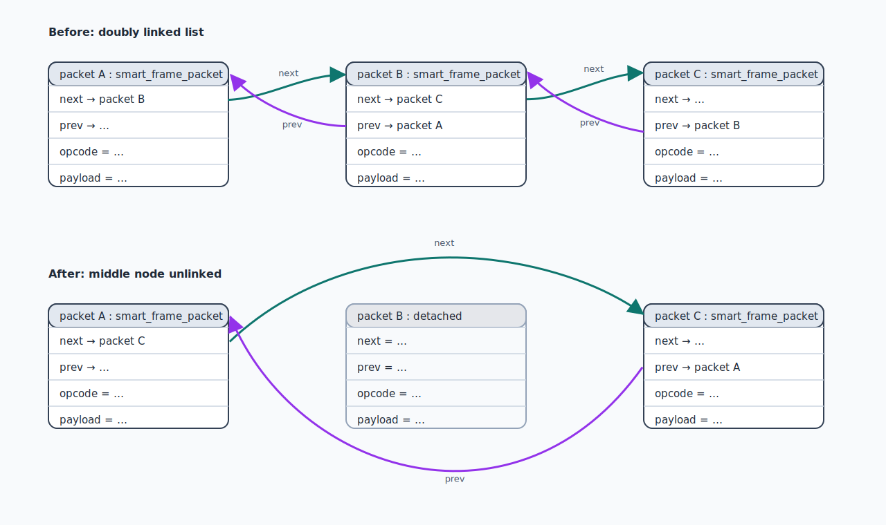
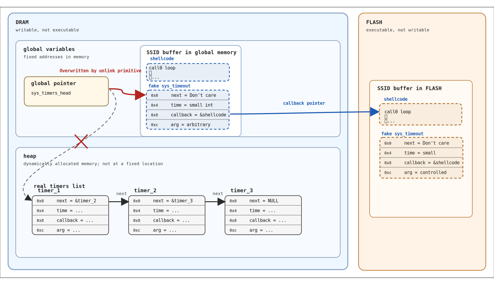

### CloudCutter on esp8266

> [!NOTE]
> **TL;DR:** The esp8266 has a similar buffer overflow to cloudcutter, but now on the stack => unlink primitive => hijacking a timer with double indirection to bypass W/X permissions => shellcode in wifi credentials flash => egghunt for a larger json payload => overwrite credentials identically to cloudcutter.


[Cloudcutter](https://github.com/tuya-cloudcutter/tuya-cloudcutter) is a tool that disconnects TUYA IOT devices from the cloud, using a remote exploit that allows you total control of the devices in your home.

Cloudcutter previously was only supported on some platforms ([Beken BK7231T and BK7231N, Realtek RTL8710BN and RTL8720CF](https://github.com/tuya-cloudcutter/tuya-cloudcutter?tab=readme-ov-file#supported-devices)).  On these platforms the exploit worked similarly, relying on a buffer overflow to a function pointer, and ROP chain to a snippet of code that ultimately overwrote the keys in flash with user controlled keys.  I highly recommend reading the [original writeup](https://rb9.nl/posts/2022-03-29-light-jailbreaking-exploiting-tuya-iot-devices/) to understand how it works.

Unfortuanately, although the esp8266 still contained essentially the same buffer overflow, the context was different enough that it was not possible to adapt the same approach to the esp8266.  However, I recently developed a new exploit chain that ultimately overwrites the same keys, allowing cloudcutter to work.  There are tens of millions[^1] of esp8266 devices that are not vulnerable to [Tuya-Convert](https://github.com/ct-Open-Source/tuya-convert), and this new exploit provides the first way to unlock those devices without having to physically disassemble them to access the chip inside.

This writeup is intended to explain in detail how the exploit chain works, for people who want to adapt it or learn from it, but it is intended to be understandable by a reader who has no prior experience with exploitataion (I didn't either, only a few months ago).

### Easy Buffer Overflows, Hard buffer overflows


The buffer overflow in the original cloudcutter exploit occurs when the user is initially configuring the device.  The device is waiting for a json message that looks like the following:

```
{"ssid": "<SSID>", "passwd": "<PASSWORD>", "token": "<TOKEN>"}
```

The "token" field is copied to a buffer *without* checking that the buffer is large enough to contain it.  Thus if you provide a long enough string as the "token", the contents of that string will be written to memory past the end of the buffer.  As it turns out, the specifics of this vulnerability made it an ideal buffer overflow to exploit, for three reasons:

1. The buffer is overflowed with data that is directly provided by the user, meaning you can choose exactly what bytes were written past the end of the buffer.
2. Shortly after the end of the overflowed buffer, there is a function pointer, which is a great target to overwrite.
3. The function pointer which is overwritten is called *immediately* after the buffer overflow.

This means that we can overwrite the function pointer address with an address of our choosing, and immediately execution will jump to that arbitrary address.  Furthermore, since we know exactly when this will happen, it's easy to analyze the state of the registers at the time we took over the control flow.  In the original exploit, the next stage is a [ROP/COP chain](https://en.wikipedia.org/wiki/Return-oriented_programming) (don't worry about the details), which eventually executes a piece of debug/testing code in the firmware, which overwrites the encryption/authentication keys in flash storage.  With the keys overwritten, the device is now vulnerable to a [Man-in-the-Middle attack](https://en.wikipedia.org/wiki/Man-in-the-middle_attack), i.e. we can pretend to be the official TUYA servers, since it thinks the keys we wrote to flash are the official TUYA keys.

In contrast, on the ESP8266, although we still directly control the data that written, the buffer overflow occurs on the stack, rather than the heap, and there is no function pointer after the end of the buffer that we can overwrite[^2].  Usually, stack buffer overflows are easier to exploit than heap buffer overflows.  This is because the stack will always contain the return pointer, which will usually be close to the end of any buffer on the stack.  This provides a juicy target to overwrite, and you know that when the exploited function returns, it will immediately start executing code at your overwritten address.  Unfortunately, the target function here will *never return*, because it is stuck in an infinite loop of reading and processing each message that comes in.  So even though we could overwrite the return pointer, it would not have any effect.

The remaining target we have to overwrite is a pointer to a `smart_frame_packet` struct, which looks like this:

```
0x0	struct smart_frame_packet*	next	
0x4	struct smart_frame_packet*	prev
0x8	uint	                    opcode	
0xc	byte*	                    payload	
```

Our approach requires a series of steps, starting with this pointer overwrite, to gain more and more capabilities, and eventually achieve the same outcome as the original exploit: overwriting the credentials in flash.

### Stage 1: The classic "Unlink"

When we trigger the initial buffer overflow, and overwrite the pointer to our `smart_frame_packet`, the subsequent code is going to treat the new address we write there as if it contains a `smart_frame_packet`.  Luckily for us, the first thing that code does is remove the packet from a doubly linked list.  Below is a diagram of what happens when you remove an element from a doubly linked list:



Or, in code form:

```
  struct smart_frame_packet *A = B->prev;
  struct smart_frame_packet *C = B->next;
  C->prev = A;
  A->next = C;
```

It can be a little difficult to wrap your head around what happens when `B` is not actually a smart frame packet, but instead is some buffer we control.  Suppose `B` is `0x1000`, and the memory at `0x1000` looks like the following:

```
0x1000 DEADBEEF
0x1004 C001D00D
```

The unlinking code will interpret `DEADBEEF` as the `next` pointer, containing the address of packet `C`, and `C001D00D` as `prev` pointer, containing the address of packet `A`.  It will then write `DEADBEEF` to the `next` pointer of `A` (which it thinks is at `C001D00D + 0x0`), and write `C001D00D` to the `prev` pointer of `C` (which it thinks is at `DEADBEEF + 0x4`).  So effectively it will do:

```
 *(0xC001D00D + 0x0) = 0xDEADBEEF
 *(0xDEADBEEF + 0x4) = C001D00D
 ```


In other words, it will take two pointers, and **write their addresses to each others addresses** (with one of the addresses offset by 4 bytes).

To take advantage of this, we just need to make sure our ducks are in a row:

1. We overwrite the `smart_frame_packet` pointer on the stack, to point to a *known* address in memory.  In our case, we know that the wifi SSID/Password[^3] are stored at a fixed memory address.
2. We make sure that address contains two specific pointers. In our case, our configuration packet contains the new SSID/password credentials, which will be copied to the fixed buffer in memory *before* the linked list removal happens.  So we embed our two pointers as a part of the wifi SSID.
3. That's it!  Once the unlink code is reached, our two writes to controlled addresses will happen!

 This pattern repeatedly shows up in exploitation, and is called the ["unlink"](https://one2bla.me/the-dark-arts/exploit-mitigations/safe-list-unlinking.html) primitive.  It is in some sense very powerful, since we can use this approach to write an "arbitrary" value to an arbitrary address in memory.  But the value is not in fact arbitrary, because it needs to point to a valid, writable address in memory itself.  If not, then our code will crash when it tries to perform the second write.  

If there was a location is memory that was writeable, executable, and controllable by us, we would be done at this point.  We could simply overwrite any function pointer to point to our shellcode in that memory region, and when that function pointer was called, it would start executing our code.  Alas, things are never that easy.

### Stage 2: Memory layout shenanigans

The ESP8266 has 32 bit virtual memory (4GB, from 0x00000000 to 0xFFFFFFFF), with the following regions mapped in[^4]:

| Name  | Address                 | Writable | Executable | User Controlled | Notes                               |
| ----- | ----------------------- | :------: | :--------: | :-------------: | ----------------------------------- |
| DRAM  | 0x3FFE8000 - 0x3FFFBFFF |    X     |            |        X        | We control the SSID/Password buffer |
| ROM   | 0x40000000 - 0x4000FFFF |          |            |                 |                                     |
| IRAM  | 0x40100000 - 0x40107FFF |    X     |     X      |                 |                                     |
| FLASH | 0x40200000 - 0x402FFFFF |          |     X      |        X        | Can't write directly, but our SSID/password will be stored here |	

Our goal is to get arbitrary code execution, meaning

1. We have written a bit of "shellcode", i.e. some arbitrary assembly code
2. We have somehow got that shellcode loaded somewhere into memory
3. The shellcode is *executable*, meaning it's in an executable region of memory
4. We are able to overwrite a function pointer somewhere so that it points to our shellcode.
5. The function pointer we hijacked gets called, and our shellcode executes, doing whatever we want it to.


In our case:

1. We have some shellcode written, but we will ignore exactly what it does for now.
2. We embed the shellcode in the wifi SSID/password, right next to the fake `smart_frame_packet` from Stage 1.
3. The SSID/password actually show up in two places in virtual memory: In DRAM, where it is actively used as part of the wifi stack, and in FLASH, where it is stored durably, so the device can remember the wifi credentials if it loses power. Only the FLASH is executable, so that is the location we use for the exploit.
4. We cannot use our unlink primitive to make a function pointer point directly to our shellcode in FLASH, since FLASH is not writable.  However, there is a trick we can do, where we don't overwrite the function pointer directly, but instead overwrite a pointer *to* the function pointer.


##### Hijacking Timers

The TUYA SDK relies on [LWIP](https://www.nongnu.org/lwip) for its networking stack.  LWIP internally keeps track of a set of timers that fire periodically (e.g. every 100, 500, 1000, 5000 milliseconds), to perform tasks like TCP timeouts, ARP cache clearing, etc.  These timers are stored in a singly linked list, ordered by their time of expiration.  LWIP periodically checks the entries of the list and calls the callback function for any entries which are due to be executed.

Each entry in the list is a `sys_timeout` struct, and looks like this:

```
0x0	struct sys_timeout* 	    next
0x4	uint	                    time
0x8	void*	                    callback
0xc	void*	                    arg
```

If we can overwrite this linked list, we can fool LWIP into thinking there is a timer due to be executed, and the next time it checks the timers, it will call a callback we control.  If we make this callback point to our shellcode in flash, execution will jump to our shellcode at that point!



TODO:fix positioning of sys_timeout

Because the global list of timers is at a fixed location in DRAM, we can overwrite it to point at a "fake" `sys_timer`, also embedded in the SSID buffer at a fixed address in DRAM.  Because both addresses are in DRAM (and therefore writable), we can use the unlink primitive from Stage 1 to perform this write.  Remember that the unlink primitive will necessarily perform *two* writes, but that is not a problem for us, because we do not care about ovewriting the `next` pointer which occupies the first 4 bytes of the `sys_timeout` struct[^5].

The important parts to get right are the `callback` field needs to point to our shellcode, and the `time` field needs to be a relatively small number, so that the callback will be called in a reasonable amount of time.  Luckily for us the SSID is stored at one of two fixed locations in FLASH, so with our shellcode embedded in the SSID, it's easy to find it's address.  On the other hand, making the `time` field be a small numbers is actually is a bit tricky, because our fake `sys_timeout` struct is also embedded in our wifi SSID, which is read from the original configuration packet we sent the device.  This configuration packet cannot have any null bytes in it, or it will be interpreted as the end of the string.  So for a 4 byte integer, the smallest value we could encode without any null bytes is `0x01010101`, which is actually quite large!  This corresponds to 269 million milliseconds, or over 3 days that we would have to wait for this to trigger!

Luckily, we have a trick that we can use to get a smaller `time` field.  Right before the wifi SSID in flash, is stored the length of the SSID as an integer, which will be `32` at most.  Rather than making the `sys_timeout` pointer point *into* our SSID buffer, we make it point 8 befores *before* the SSID buffer, so that the 32 bit SSID length lines up exactly with the `time` field in the fake `sys_timeout` struct.  This way when the timer check occurs, it will read the ssid length as the timeout, which will cause the timer callback to be called after only a few milliseconds.

TODO: Diagram of the fake sys_timeout

### Stage 3: Shellcode

With the previous two stages, we have gone from a buffer overflow, to arbitrary code execution.  Aren't we basically done?  Well, not quite, since it turns out we don't really have much *room* to fit assembly code that does anything interesting.

Recall, in stage 1, we put a fake `smart_frame_packet` in our SSID, which takes up 16 bytes.  In stage 2, we put half of a `sys_timeout` packet in there as well, which takes up another 8 bytes.  The SSID only fits 32 bytes maximum, so there's only 8 bytes left!  Luckily, we also have the wifi password as a place to store shellcode.  But even then, that's only an additional 64 bytes.  Each instruction takes up 2-3 bytes, and addresses we need to reference take up 4 bytes... we really have maybe 20 instructions to work with to do something interesting.

Really, by "doing something interesting", we need to do one of two things:  We either need to overwrite the keys in flash, or we need to somehow exfiltrate the keys.  We chose to follow the cloudcutter approach of overwriting the keys in flash, because it was proven to work, and because it allows us to reuse the same tools for the remained of the exploit that cloudcutter used.

So to review, how exactly did cloudcutter overwrite the credentials in flash?  The key is the `FOOBAR` function, a test function which is not used by the TUYA SDK, which will overwrite the keys after running some checks.  However, if you can jump into the middle of the function after the checks have been skipped, but before the keys have been written, it will do all the steps necessary to get your chosen keys saved to FLASH.  The only requirement is that you need a json payload containing the new configuration to write to flash.  Note this is a *different* json payload than the original configuration packet we sent that caused the buffer overflow.

The payload looks like the following:
```
{
  "auzkey": "<length 32 string>",
  "pskkey": "<length 37 string>",
  "prod_test": false,
  "prod_idx": "<nonempty string>"
}
```

By providing known values for the auzkey and pskkey, we will be able to MITM the device upon reboot.

If we try to make the minimal version of this payload, we will set prod_idx to be a one character string, and remove any extraneous whitespace, giving a minimal length of 59 + 32 + 37 = 128.  There is absolutely no way we can fit this payload inside of our SSID+password.


2. we must have auzkey with size 32,
3. we must have pskkey with size 37
4. prod_test must be present and false, but it doesn't type check, so any non-boolean will be interpreted as false.
5. prod_idx must be present, but it doesn't have to be a string because again they don't type check, so it will just be interpreted as an empty strings


[^1]: Tuya doesn't release enough information to determine exactly how many newly exploitable devices there are.  We estimate conservatively tens of millions based on the following information: [We know Tuya activated 88 million devices before 2020, and over 100m in 2020 and 2021 each](https://www1.hkexnews.hk/listedco/listconews/sehk/2022/0622/2022062200189.pdf).  The Tuya-convert vulnerability was patched in Q1 2019, and the vast majority of devices sold at the beginning of 2020 were esp8266 based, but by 2021 they were mostly using Beken and Realtek chips.  This is still a very rough timeline, since there is a delay between when the new firmware appears and when it actually is used by newly manufactured devices (in general, products stay on the firmware version that was chosen when they started being manufactured).  Furthermore, there is a delay from when the product is manufactured to when it is bought, installed, and activated. Thus it seems likely that there could be upwards of 100m newly exploitable devices (i.e. esp8266 based devices which were not already vulnerable to Tuya-Convert), but due to the uncertainty involved, tens of millions seems like a more conservative estimate.

[^2]: Technically, there is a second buffer overlow which will occur right after the first one, when copying from our overflowed buffer to a wifi configuration struct on the heap.  Unfortunately, this struct doesn't have any juicy targets to overwrite.  It still might be possible to [exploit the heap overflow](https://en.wikipedia.org/wiki/Heap_overflow), but the malloc implementation actually *scans every allocated block* before deallocation to prevent double frees, so the classic ["unlink"](https://one2bla.me/the-dark-arts/exploit-mitigations/safe-list-unlinking.html) approach does not work.  I made some failed attempts at exploiting the heap overflow by overflowing into the next chunk in the heap; it was difficult to get anything interesting in the the right spot in the heap at the time of the overflow.

[^3]: SSID is just the technical term for the name of a wifi conntection.

[^4]: The [full memory map](https://github.com/esp8266/esp8266-wiki/wiki/Memory-Map) is more complicated, but I have simplified it here to the main sections.

[^5]: We have to be a bit careful about setting up the unlink writes, since one of the writes is offset by 4 bytes.  4 bytes offset from the `sys_timeout` struct is the `time` field, which we *do* care if it gets overwritten.  However, we can avoid this by making sure that the *other* write is offset by 4 bytes, i.e. in our fake `smart_frame_packet` struct, we set `next = &fake_sys_timeout` and `prev = &global_sys_timeout_queue - 4 bytes`.  This way the `global_sys_timeout_queue` will be overwritten with the address of the `fake_sys_timeout`, and `fake_sys_timeout.next` (which we do not care about)  will be overweritten with the address 4 bytes before `global_sys_timeout_queue`